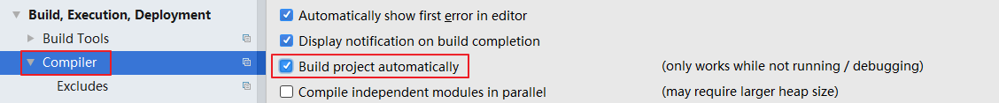
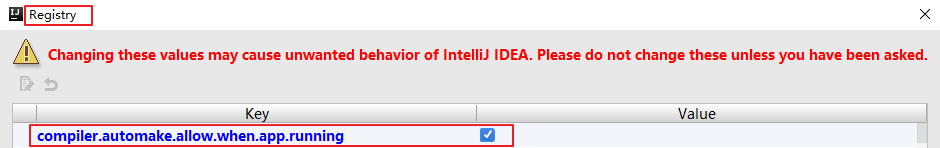
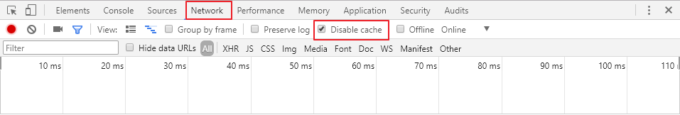

# SpringBootDemo

#### SpringBoot项目在IntelliJ IDEA中实现热部署
spring-boot-devtools是一个为开发者服务的一个模块，其中最重要的功能就是自动应用代码更改到最新的App上面去。
原理是在发现代码有更改之后，重新启动应用，但是速度比手动停止后再启动更快。
其深层原理是使用了两个ClassLoader，一个Classloader加载那些不会改变的类(第三方Jar包),另一个ClassLoader加载会更改的类，称为restart ClassLoader,这样在有代码更改的时候，原来的restart ClassLoader被丢弃，重新创建一个restart ClassLoader，由于需要加载的类相比较少，所以实现了较快的重启时间。
即devtools会监听classpath下的文件变动，并且会立即重启应用（发生在保存时机）。
##### 一、开启idea自动make功能 
###### 1、CTRL + SHIFT + A --> 查找make project automatically --> 选中
 
###### 2、CTRL + SHIFT + A --> 查找Registry --> 找到并勾选compiler.automake.allow.when.app.running
 
###### 3、重启idea 
##### 二、使用spring-boot-1.3开始有的热部署功能 
###### 1、加maven依赖
```
<dependency>
    <groupId>org.springframework.boot</groupId>
    <artifactId>spring-boot-devtools</artifactId>
    <optional>true</optional>
</dependency>
```
###### 2、开启热部署
```
<build>
    <plugins>
        <plugin>
            <groupId>org.springframework.boot</groupId>
            <artifactId>spring-boot-maven-plugin</artifactId>
            <configuration>
                <fork>true</fork>//该配置必须
            </configuration>
        </plugin>
    </plugins>
</build>
```
##### 三、Chrome禁用缓存 
###### F12（或Ctrl+Shift+J或Ctrl+Shift+I）--> NetWork --> Disable Cache(while DevTools is open) 

至此，在idea中就可以愉快的修改代码了，修改后可以及时看到效果，无须手动重启和清除浏览器缓存。
###### 测试方法：
1. 修改类-->保存：应用会重启
2. 修改配置文件-->保存：应用会重启
3. 修改页面-->保存：应用会重启，页面会刷新（原理是将spring.thymeleaf.cache设为false）
###### 不能使用分析：
1. 对应的spring-boot版本是否正确，我这里使用的是1.5.3.RELEASE版本；
2. 是否加入plugin了，以及属性<fork>true</fork>
3. Intellij IDEA是否开启了Make Project Automatically。
4. 如果设置SpringApplication.setRegisterShutdownHook(false)，则自动重启将不起作用。
#####参考：
[http://412887952-qq-com.iteye.com/blog/2300313](http://412887952-qq-com.iteye.com/blog/2300313)